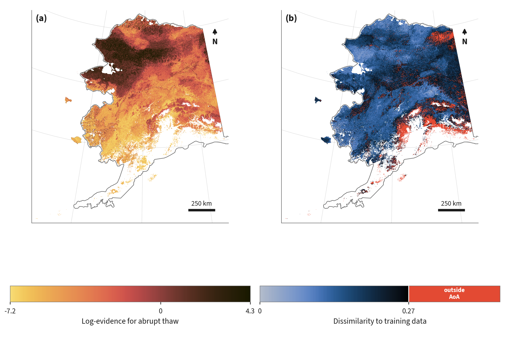

# abrupt-thaw-indicators

[](LICENSE)
[](https://www.python.org/downloads/)
[](https://doi.org/10.5281/zenodo.XXXXXXX)
[](https://doi.org/10.5281/zenodo.23068691)

Code for "Susceptibility to Abrupt Thaw across Alaska's Permafrost Landscapes" (Earth's Future, submitted). Using 19,288 expert-labeled sites from the Alaska Permafrost Thaw Database as training data, a gradient-boosted classifier (XGBoost) learns which geospatial indicators separate abrupt from non-abrupt permafrost thaw. The model is evaluated under spatial cross-validation, interpreted post-hoc with grouped SHAP values, and applied statewide on a 1 km grid. The main product is a thaw mode index across Alaska's permafrost domain, indicating the relative susceptibility to abrupt thaw, paired with an area-of-applicability layer that flags where the regions lie outside the training data.



## The map

The map is `susceptibility.nc` in the data record, a NetCDF file on a 1 km latitude–longitude grid. It covers Alaska's permafrost. Areas without permafrost (Obu et al. 2019) are left blank.

| Variable | What it shows |
| --- | --- |
| `log_evidence` | How strongly local conditions point to abrupt rather than non-abrupt thaw. |
| `DI` | How different a location is from the sites the model learned from. Higher values indicate greater difference. |
| `inside_aoa` | `1` where a location is similar enough to the training sites for the map to apply, `0` where it isn't. |

In `log_evidence`, 0 means the evidence is balanced. Positive values favor abrupt thaw, negative values favor non-abrupt thaw, and larger numbers mean stronger evidence. It is not a calibrated probability, because the true distribution of abrupt and non-abrupt thaw on the landscape is unknown. Most training sites are abrupt thaw because of where people went looking, not because abrupt thaw is that common, and the index removes that imbalance. For the same reason, there is no natural cutoff for splitting the map into abrupt and non-abrupt zones. Where `inside_aoa` is `0`, the model is extrapolating, so treat those values with caution.

```python
import xarray as xr

ds = xr.open_dataset("susceptibility.nc")
index = ds["log_evidence"].where(ds["inside_aoa"] == 1)
index.sel(lat=64.84, lon=-147.72, method="nearest").item()  # Fairbanks
```

In QGIS, add the file as a raster layer and pick the variable when prompted.

## Setup

Requires Python 3.13 and [Poetry](https://python-poetry.org/).

```bash
git clone https://github.com/ethan-pierce/abrupt-thaw-indicators.git
cd abrupt-thaw-indicators
poetry install
```

Steps marked **GEE** below need Google Earth Engine. Scripts call `ee.Initialize(project=settings.EE_PROJECT)` and fall back to `ee.Authenticate()` when there are no cached credentials. Set `EE_PROJECT` in `settings.py` to your own Cloud project, or run `poetry run earthengine authenticate` once.

## Data inputs

Third-party data are not redistributed. Earth Engine sources are read in place; the rest are expected at the paths below.

| Product | Access | Local path | Used by |
| --- | --- | --- | --- |
| Alaska Permafrost Thaw Database v2.0.0 ([10.5281/zenodo.17494851](https://doi.org/10.5281/zenodo.17494851)), CC0 | included | `data/Alaska_Permafrost_Thaw_Database_v2.0.0.csv` | feature table |
| USGS 3DEP 10 m DEM ([ScienceBase](https://www.sciencebase.gov/catalog/item/4f70aa9fe4b058caae3f8de5)) | GEE `USGS/3DEP/10m` | — | features |
| MERIT Hydro v1.0.1 ([project page](http://hydro.iis.u-tokyo.ac.jp/~yamadai/MERIT_Hydro/)) | GEE `MERIT/Hydro/v1_0_1` | — | features |
| WorldClim v1.4 bioclimatic variables ([worldclim.org](https://www.worldclim.org/data/v1.4/worldclim14.html)) | GEE `WORLDCLIM/V1/BIO` | — | features |
| SoilGrids 2.0 ([10.5194/soil-7-217-2021](https://doi.org/10.5194/soil-7-217-2021)) | GEE `projects/soilgrids-isric/*_mean` | — | features |
| Daymet V4 ([10.3334/ORNLDAAC/1840](https://doi.org/10.3334/ORNLDAAC/1840)) | GEE `NASA/ORNL/DAYMET_V4`, reduced by `build_daymet_rasters.py` | `data/daymet/daymet_v4_reductions_1km_3338.tif` | features |
| MODIS MCD64A1 v6.1 ([10.5067/MODIS/MCD64A1.061](https://doi.org/10.5067/MODIS/MCD64A1.061)) | GEE `MODIS/061/MCD64A1`, reduced by `build_modis_fire_rasters.py` | `data/modis_fire/mcd64a1_fire_history_500m_3338.tif` | features |
| ALFRESCO flammability and vegetation mode ([SNAP](https://data.snap.uaf.edu/data/IEM/Outputs/ALF/Gen_1a/)) | download with `fetch_alfresco.py` | `data/alfresco/` | features |
| NLCD 2016 Alaska ([10.5066/P96HHBIE](https://doi.org/10.5066/P96HHBIE)) | manual download | `data/NLCD2016/NLCD_2016_Land_Cover_AK_20200724.img` | features |
| IRYP v2 yedoma ([10.1594/PANGAEA.940078](https://doi.org/10.1594/PANGAEA.940078)) | manual download | `data/IRYP_v2_yedoma_confidence_Shapefile/IRYP_v2_yedoma_confidence.shp` | features |
| Obu et al. permafrost probability ([10.1594/PANGAEA.888600](https://doi.org/10.1594/PANGAEA.888600)) | manual download | `data/Obu2019/UiO_PEX_PERPROB_5.0_20181128_2000_2016_NH.tif` | domain mask, Fig 2 |
| Circumpolar Thermokarst Landscapes ([10.3334/ORNLDAAC/1332](https://doi.org/10.3334/ORNLDAAC/1332)) | manual download | `data/Circumpolar_Thermokarst_Landscapes/Circumpolar_Thermokarst_Landscapes.shp` | Fig 10 |
| EPA Level III Ecoregions of Alaska ([EPA](https://www.epa.gov/eco-research/ecoregion-download-files-state-region-10)) | manual download | `data/ak_eco_l3/ak_eco_l3.shp` | Fig 9 |

## Reproduce

Run everything with `poetry run python <script>` from the repository root.

**1. Features** 

| Step | Script | Output |
| --- | --- | --- |
| 1a | `data/fetch_alfresco.py` | `data/alfresco/*.tif` |
| 1b **GEE** | `data/build_daymet_rasters.py` | Daymet raster |
| 1c **GEE** | `data/build_modis_fire_rasters.py` | MODIS fire raster |
| 1d **GEE** | `data/build_feature_table.py` | `data/features_dirty.csv` |
| 1e **GEE** | `data/build_prediction_data.py` | `data/prediction_data.nc` |

To skip 1e, download `prediction_datacube.nc` from the data record and save it as `data/prediction_data.nc`. It has the same schema.

**2. Model, map, and diagnostics**

1. `data/clean_feature_table.py` → `data/features_clean.csv`
2. `models/train_xgboost.py` → `models/model.json`, `cv_config.json`, `selected_hparams.json`, `run_manifest.json`
3. `diagnostics/repeated_cv.py`, `diagnostics/extrapolation_range.py` → JSON inputs for Fig 5
4. `diagnostics/feature_provenance.py`, `diagnostics/block_cv.py` 
5. `models/shap_values.py`, `models/shap_groups.py`, `models/shap_mechanism_cache.py`
6. `models/predict.py` → `data/susceptibility.nc`
7. `diagnostics/aoa_calibration.py` → `models/aoa_threshold.json`
8. `models/aoa.py` → `data/aoa.nc`
9. `models/shap_dominance_cache.py`
10. `data/export_zenodo.py` → `data/zenodo/`

**3. Figures**

Run `output/fig05_cache_build.py`, then each `output/fig*.py` and `output/render_family_dendrogram.py`. Figure 1a is drawn in `output/process-schematic-revised.pptx` and exported by hand to `output/fig01_schematic_panel.pdf`.

## Layout

```
data/          feature extraction (GEE + local rasters), cleaning, datacube build, Zenodo export
models/        spatial CV, training, SHAP, prediction, area of applicability; model.json and run config
diagnostics/   analyses behind specific numbers in the paper (repeated CV, extrapolation range,
               buffer sweep, univariate separation, AoA threshold calibration)
output/        figure scripts, figure style, and rendered figures
manuscript/    LaTeX source (excluded from release archives)
settings.py    paths, metadata column names, and the Earth Engine project
```

## Citation

- **Paper:** Pierce, E., Overeem, I., Webb, H., Rozmiarek, K., & Turetsky, M. (submitted). Susceptibility to Abrupt Thaw across Alaska's Permafrost Landscapes. *Earth's Future*.
- **Code:** Pierce, E. (2026). abrupt-thaw-indicators v1.0.0. Zenodo. https://doi.org/10.5281/zenodo.XXXXXXX
- **Data:** Pierce, E., Overeem, I., Webb, H., Rozmiarek, K., & Turetsky, M. (2026). Map of Abrupt Thaw Susceptibility across Alaska's Permafrost Domain (1.0.0). Zenodo. https://doi.org/10.5281/zenodo.23068691

The data record holds the susceptibility map (`log_evidence`, `DI`, `inside_aoa`), the prediction datacube, the training feature table, and a data dictionary.

Questions about the map: open a [GitHub issue](https://github.com/ethan-pierce/abrupt-thaw-indicators/issues) or email ethan.g.pierce@dartmouth.edu.

## Licenses

- Code: GPL-3.0-or-later (`LICENSE`), including the trained model in `models/model.json`.
- Data record: CC-BY-4.0.
- Alaska Permafrost Thaw Database: CC0.
- Field photos in `data/photos/`: courtesy of Irina Overeem and Kevin Rozmiarek.
